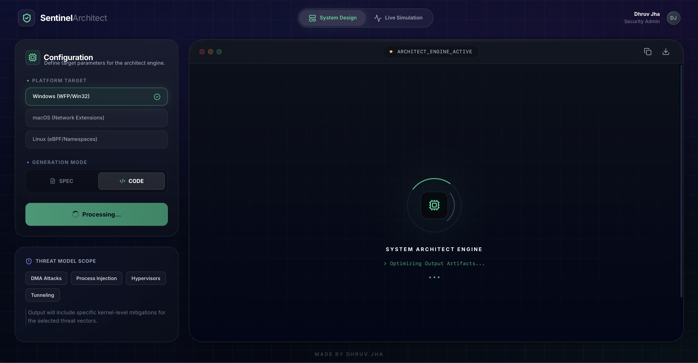
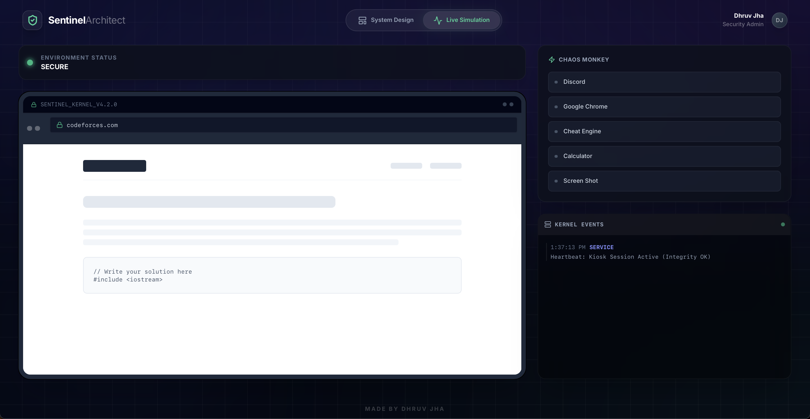
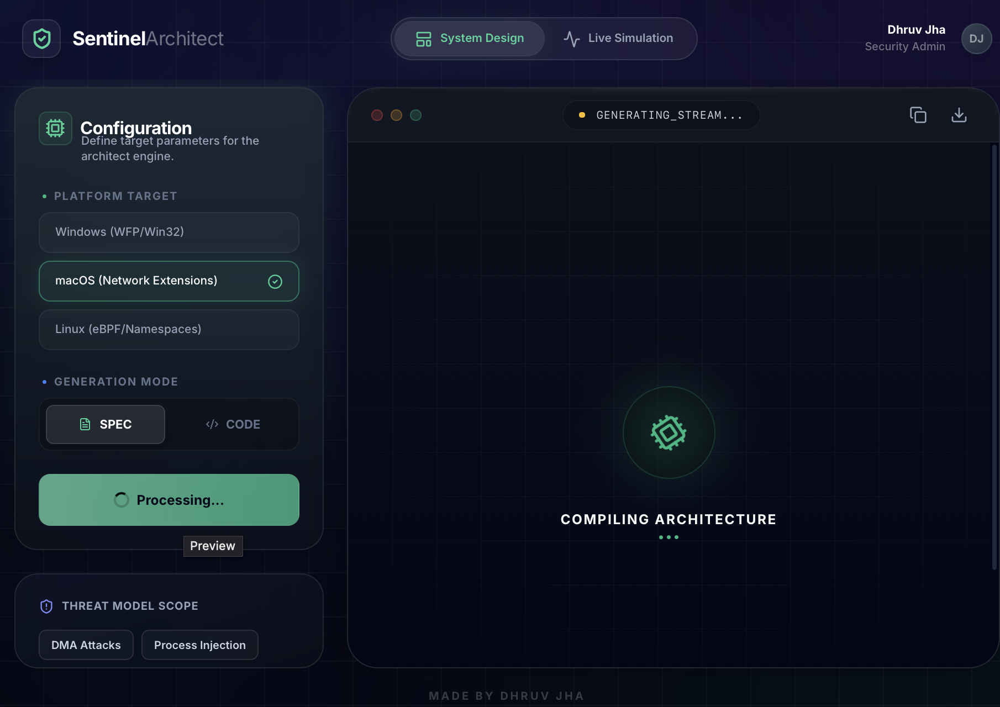
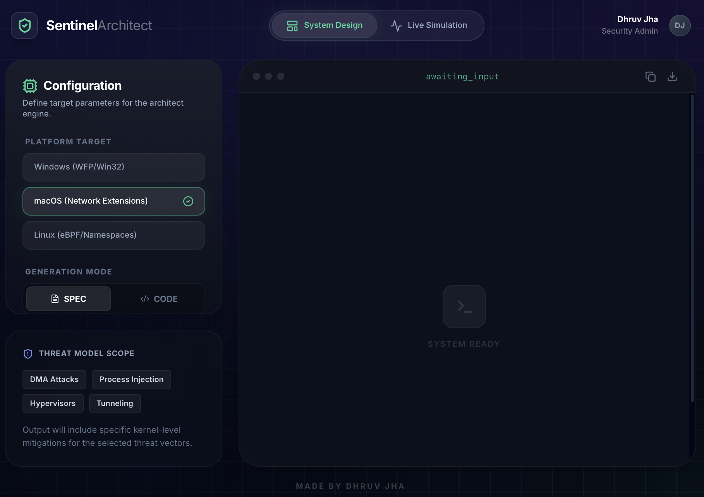
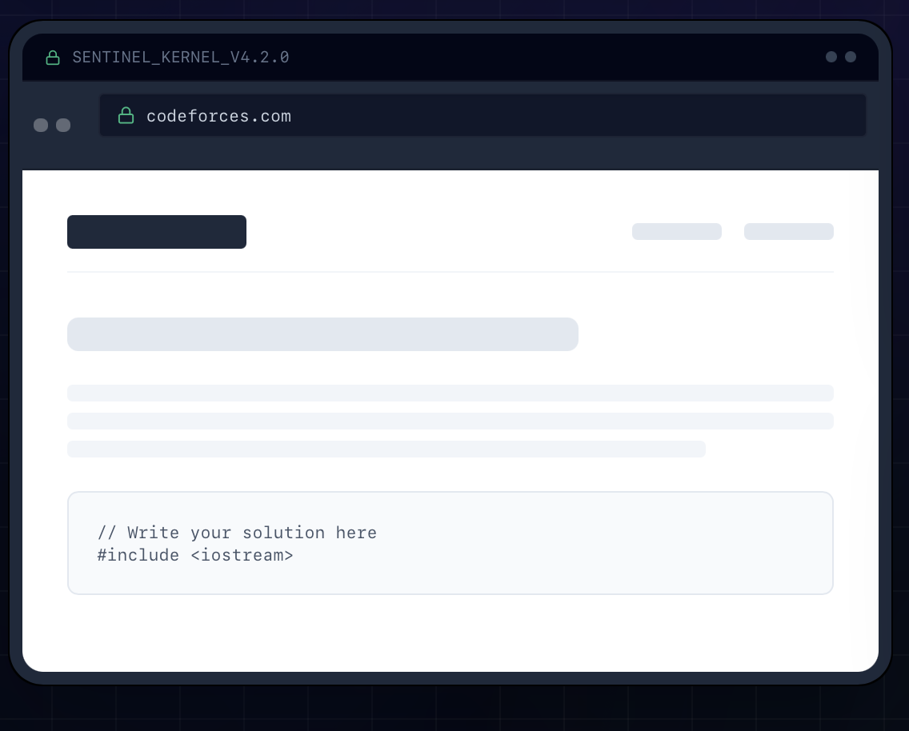
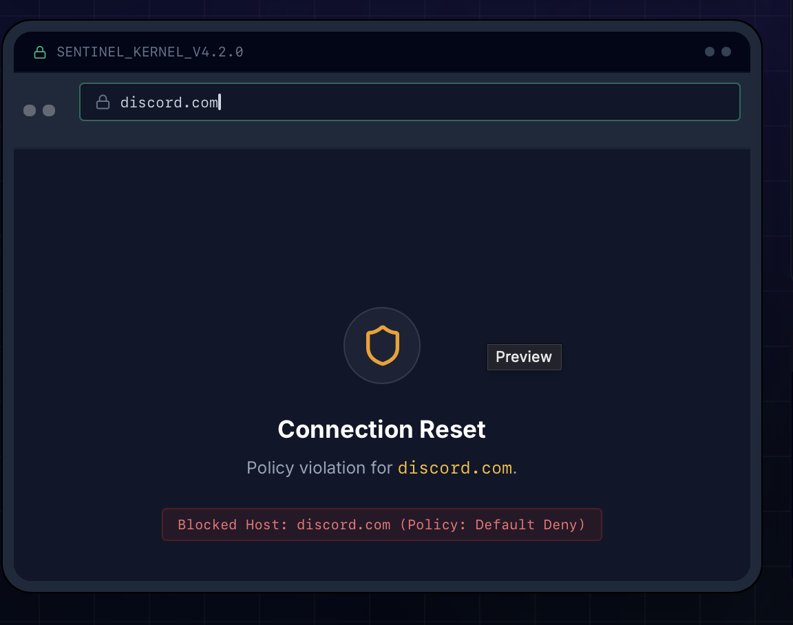
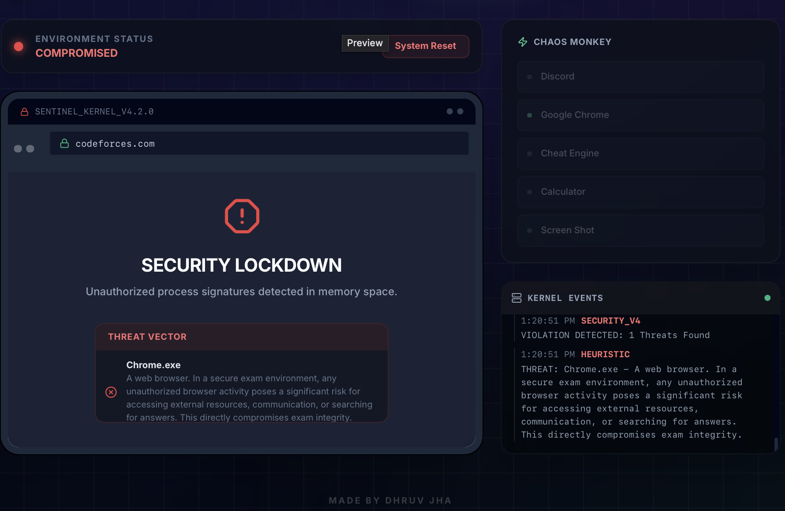
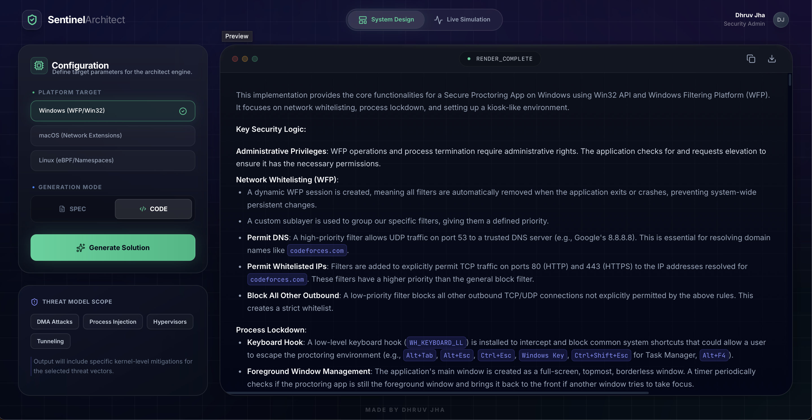

# Sentinel Architect

<div align="center">
  
</div>

<div align="center">
  <strong>AI-Powered Secure Proctoring System Architect & Live Simulation Platform</strong>
</div>

---

## 📋 Table of Contents

- [Overview](#overview)
- [Demo & Screenshots](#demo--screenshots)
- [Architecture Decisions](#architecture-decisions)
- [Features](#features)
- [Technical Stack](#technical-stack)
- [Project Structure](#project-structure)
- [Installation & Setup](#installation--setup)
- [Usage Guide](#usage-guide)
- [Component Architecture](#component-architecture)
- [Service Layer](#service-layer)
- [Development Process](#development-process)
- [Security Considerations](#security-considerations)
- [Future Enhancements](#future-enhancements)

---

## 🎯 Overview

**Sentinel Architect** is a dual-mode application designed to architect and simulate secure, system-level proctoring solutions for competitive programming environments. The platform addresses the critical need for robust anti-cheat mechanisms in online examinations by providing:

1. **AI-Powered Architecture Generation**: An intelligent system architect that generates comprehensive technical specifications and implementation code for secure proctoring environments across multiple operating systems.

2. **Live Simulation Kiosk**: A high-fidelity frontend simulation that demonstrates real-time threat detection, network filtering, and process monitoring capabilities.

### Problem Statement

Online competitive programming examinations face significant security challenges:
- **Network-based cheating**: Unauthorized access to external resources, communication tools, or AI assistants
- **Process injection attacks**: Malicious software attempting to bypass security measures
- **Virtualization detection**: Candidates running exams in virtual machines to evade monitoring
- **Debugger-based manipulation**: Tools attempting to analyze or modify exam processes
- **DMA (Direct Memory Access) attacks**: Hardware-level memory access bypassing software security

### Solution Approach

Sentinel Architect provides a comprehensive solution by:
- Generating platform-specific security architectures using AI
- Simulating real-world threat scenarios in a controlled environment
- Providing detailed technical documentation and code implementations
- Supporting multiple operating systems (Windows, macOS, Linux)

---

## 🎬 Demo & Screenshots

> **Note**: Demo screenshots are available in the `images/demo/` directory. The images below reference the expected filenames. You can view all available screenshots in the [images/demo directory](images/demo/).

### Main Interface

The application features a modern dark-themed interface with dual-mode functionality:

<div align="center">
  
  <p><em>Main Interface: System Design Mode with Configuration Panel</em></p>
</div>

### System Design Mode

#### Configuration Panel
The left panel allows users to configure platform targets, generation modes, and threat model scope:

<div align="center">
  
  <p><em>Configuration Panel: Select OS Target (Windows/macOS/Linux) and Generation Mode (SPEC/CODE)</em></p>
</div>

#### Architecture Generation (Specification Mode)
When generating specifications, the system creates comprehensive technical documentation:

<div align="center">
  
  <p><em>Specification Mode: Generating technical architecture documentation with Mermaid diagrams</em></p>
</div>

#### Code Generation Mode
Code mode generates platform-specific implementation code:

<div align="center">
  
  <p><em>Code Generation Mode: Windows WFP implementation with security logic</em></p>
</div>

#### Processing State
During AI generation, the interface shows animated loading states:

<div align="center">
  
  <p><em>Processing: System Architect Engine optimizing output artifacts</em></p>
</div>

### Live Simulation Mode

#### Secure Environment
The simulation kiosk shows a secure exam environment with Codeforces access:

<div align="center">
  
  <p><em>Live Simulation: Secure environment with Codeforces access and system monitoring</em></p>
</div>

#### Network Filtering
The system demonstrates real-time network filtering with whitelist enforcement:

<div align="center">
  
  <p><em>Network Filtering: Discord.com blocked due to policy violation (Default Deny)</em></p>
</div>

<div align="center">
  
  <p><em>Network Filtering: Codeforces.com allowed (whitelisted domain)</em></p>
</div>

#### Threat Detection
The system detects and responds to security threats in real-time:

<div align="center">
  
  <p><em>Threat Detection: Calculator.exe detected as suspicious during exam session</em></p>
</div>

<div align="center">
  
  <p><em>Multiple Threats: Calc.exe and SnippingTool.exe detected simultaneously</em></p>
</div>

#### Security Lockdown
When threats are detected, the system enters lockdown mode:

<div align="center">
  
  <p><em>Security Lockdown: System compromised - unauthorized processes detected</em></p>
</div>

#### Various Threat Scenarios

**Chrome Browser Detection:**
<div align="center">
  
  <p><em>Threat: Chrome.exe detected - unauthorized browser activity blocked</em></p>
</div>

**Cheat Engine Detection:**
<div align="center">
  
  <p><em>Critical Threat: CheatEngine.exe detected - memory manipulation tool</em></p>
</div>

**Discord Communication Tool:**
<div align="center">
  
  <p><em>Threat: Discord.exe detected - communication platform violation</em></p>
</div>

**System Process Anomalies:**
<div align="center">
  
  <p><em>Anomaly Detection: Suspicious Registry process detected</em></p>
</div>

### Key Features Showcase

#### Real-Time Kernel Event Logging
<div align="center">
  
  <p><em>Kernel Events: Real-time security event logging with color-coded severity levels</em></p>
</div>

#### Chaos Monkey - Threat Injection
<div align="center">
  
  <p><em>Chaos Monkey: Simulate threat injection for testing security responses</em></p>
</div>

### Interface Elements

#### Status Indicators
- **SECURE**: Green indicator showing system integrity
- **COMPROMISED**: Red indicator with threat details
- **System Reset**: Admin override functionality

#### Navigation
- **System Design**: AI-powered architecture generation
- **Live Simulation**: Interactive threat detection demo

#### Visual Design
- Dark theme with glassmorphism effects
- Gradient borders and glow effects
- Terminal-inspired log displays
- Modern, professional aesthetic

---

**Note**: Demo screenshots have been added to the `images/demo/` directory. The images are now available and will display in the README. If you'd like to rename them to match the expected naming convention (e.g., `demo-main-interface.png`), you can do so and update the image paths in this README accordingly.

**Available Screenshots**: 15 demo screenshots are currently in the repository showing various features of the application including:
- System Design Mode interface
- Configuration panels
- Architecture generation outputs
- Live Simulation Mode
- Network filtering demonstrations
- Threat detection scenarios
- Security lockdown states

---

## 🏗️ Architecture Decisions

### 1. **Dual-Mode Application Design**

**Decision**: Implement two distinct modes (Architect and Simulation) within a single application.

**Rationale**:
- **Separation of Concerns**: Architecture generation and simulation serve different purposes and user workflows
- **Resource Optimization**: Users can focus on one mode at a time, reducing cognitive load
- **Scalability**: Each mode can evolve independently without affecting the other
- **User Experience**: Clear mode switching provides intuitive navigation

**Implementation**:
- Centralized mode state management in `App.tsx`
- Conditional rendering based on `AppMode` enum
- Shared layout component (`AppLayout`) for consistent UI/UX

### 2. **Component-Based Architecture**

**Decision**: Modular React component structure with clear separation of concerns.

**Rationale**:
- **Maintainability**: Each component has a single responsibility
- **Reusability**: Components can be easily extended or modified
- **Testability**: Isolated components are easier to unit test
- **Developer Experience**: Clear component boundaries improve code navigation

**Component Hierarchy**:
```
App
├── AppLayout (Layout & Navigation)
├── ArchitectPanel (AI Generation Interface)
└── SimulationKiosk (Live Threat Simulation)
```

### 3. **Service Layer Abstraction**

**Decision**: Centralized service layer (`geminiService.ts`) for all AI interactions.

**Rationale**:
- **API Abstraction**: Changes to AI provider can be isolated to one file
- **Error Handling**: Centralized error management and fallback strategies
- **Type Safety**: Consistent TypeScript interfaces across AI operations
- **Future-Proofing**: Easy to swap or add additional AI providers

**Service Functions**:
- `generateArchitectArtifact()`: Generates specifications or code implementations
- `analyzeThreatScenario()`: Performs threat analysis on process lists
- `checkUrlAccess()`: Validates URL access against whitelist policies

### 4. **TypeScript-First Development**

**Decision**: Strict TypeScript usage with comprehensive type definitions.

**Rationale**:
- **Type Safety**: Catch errors at compile-time rather than runtime
- **Developer Experience**: IntelliSense and autocomplete support
- **Documentation**: Types serve as inline documentation
- **Refactoring Safety**: Type system prevents breaking changes

**Type System**:
- Enums for mode and OS selection (`AppMode`, `OsTarget`, `ArtifactType`)
- Interfaces for data structures (`LogEntry`, `SecurityThreat`)
- Strict null checking and type inference

### 5. **Modern Build Tooling (Vite)**

**Decision**: Use Vite instead of Create React App or Webpack.

**Rationale**:
- **Performance**: Lightning-fast HMR (Hot Module Replacement)
- **Modern Standards**: Native ES modules support
- **Developer Experience**: Instant server start and optimized builds
- **Future-Ready**: Built for modern JavaScript tooling

### 6. **AI Model Selection (Gemini 2.5 Flash)**

**Decision**: Use Google's Gemini 2.5 Flash model for all AI operations.

**Rationale**:
- **Speed**: Flash model provides fast response times for interactive applications
- **Cost-Effectiveness**: Lower token costs for high-frequency operations
- **Quality**: Sufficient capability for technical documentation and code generation
- **Reliability**: Google's infrastructure ensures consistent availability

### 7. **State Management Strategy**

**Decision**: React hooks (`useState`, `useEffect`) for local component state.

**Rationale**:
- **Simplicity**: No external state management library needed for current scope
- **Performance**: Component-level state is sufficient for UI interactions
- **Bundle Size**: Avoids additional dependencies
- **Future Flexibility**: Can migrate to Redux/Zustand if complexity grows

### 8. **UI/UX Design Philosophy**

**Decision**: Dark theme with glassmorphism and gradient effects.

**Rationale**:
- **Professional Aesthetic**: Security tools benefit from a serious, technical appearance
- **Visual Hierarchy**: Dark backgrounds with bright accents draw attention to important elements
- **Modern Design**: Glassmorphism effects create depth and sophistication
- **Accessibility**: High contrast ratios maintain readability

**Design Elements**:
- Backdrop blur effects for depth
- Gradient borders and glows for emphasis
- Smooth animations and transitions
- Terminal-inspired log displays

---

## ✨ Features

### 1. **AI-Powered Architecture Generation**

#### Specification Mode
Generates comprehensive technical documentation including:
- **Architecture Diagrams**: Mermaid-formatted system architecture visualizations
- **Kernel-Level Isolation Strategy**: Platform-specific isolation mechanisms
  - Windows: Windows Filtering Platform (WFP) implementation
  - macOS: Network Extensions framework
  - Linux: eBPF and namespace-based isolation
- **Network Filtering Implementation**: Detailed whitelist-based filtering logic
- **Anti-Cheat & Integrity Checks**: Process monitoring and validation mechanisms
- **Bypass Vectors & Countermeasures**: Threat analysis and mitigation strategies

#### Codebase Mode
Generates production-ready implementation code:
- **Language-Specific Code**: 
  - Windows: C++ with Win32 API and WFP
  - macOS: Swift with SystemExtensions
  - Linux: C++ with eBPF/libbpf
- **Core Components**:
  - Network filter with codeforces.com whitelisting
  - Process lockdown mechanisms
  - Main entry point for kiosk session initialization
- **Security Logic**: Commented code explaining security decisions

**User Experience**:
- Real-time loading animations with contextual status messages
- Markdown rendering for formatted output
- Copy-to-clipboard functionality
- Download as markdown file
- Platform-specific customization (Windows, macOS, Linux)

### 2. **Live Simulation Kiosk**

#### Virtual Exam Environment
A fully interactive simulation of a secure proctoring kiosk:

**Status Monitoring**:
- Real-time security status indicator (SECURE/COMPROMISED)
- Visual feedback with color-coded status lights
- System reset functionality for compromised states

**Browser Interface**:
- Simulated browser with URL bar
- Network filtering demonstration
- Whitelist-based access control
- Visual feedback for allowed/blocked connections
- Mock Codeforces UI for allowed sites

**Process Management**:
- Real-time process list display
- Default system processes (ProctorApp.exe, System, Registry, etc.)
- Process injection simulation ("Chaos Monkey")
- Visual indicators for active processes

#### Threat Detection System

**Heuristic Scanning**:
- AI-powered threat analysis of process lists
- Automatic threat detection on process injection
- Risk level classification (HIGH, MEDIUM, LOW)
- Threat description and mitigation suggestions

**Threat Categories Detected**:
- Screen sharing applications
- Debugging tools
- Communication platforms (Discord, etc.)
- Cheat engines and manipulation tools
- Unauthorized system utilities

**Security Lockdown**:
- Automatic system lockdown on threat detection
- Visual security alert overlay
- Detailed threat vector display
- Admin override for system reset

#### Real-Time Logging System

**Kernel Event Logs**:
- Timestamped log entries
- Color-coded log levels (INFO, WARN, CRITICAL, SUCCESS)
- Source identification (KERNEL_CB, NET_FILTER, FIREWALL, etc.)
- Auto-scrolling terminal interface
- Ambient heartbeat messages

**Log Sources**:
- `KERNEL_CB`: Kernel callback events
- `NET_FILTER`: Network filtering operations
- `WFP_DRIVER`: Windows Filtering Platform driver events
- `FIREWALL`: Firewall rule enforcement
- `SENTINEL_CORE`: Core security engine
- `SECURITY_V4`: Security validation layer
- `HEURISTIC`: Threat analysis engine
- `ADMIN_CONSOLE`: Administrative actions

### 3. **Multi-Platform Support**

**Operating System Targets**:
- **Windows**: WFP (Windows Filtering Platform) and Win32 API
- **macOS**: Network Extensions and SystemExtensions
- **Linux**: eBPF (Extended Berkeley Packet Filter) and namespaces

**Platform-Specific Features**:
- OS-specific code generation
- Platform-appropriate security mechanisms
- Native API utilization recommendations

### 4. **Network Filtering Simulation**

**Whitelist-Based Filtering**:
- Primary domain: `codeforces.com`
- CDN and subdomain support
- Font and asset loading (Google Fonts, Cloudflare CDN)
- Default deny policy for all other domains

**URL Validation**:
- Real-time URL parsing and validation
- Hostname extraction and matching
- Subdomain support (e.g., `assets.codeforces.com`)
- Visual feedback for allowed/blocked states

### 5. **Interactive Threat Injection**

**Chaos Monkey Feature**:
- Simulate malicious process injection
- Pre-defined threat applications:
  - Discord.exe (HIGH risk)
  - Chrome.exe (MEDIUM risk)
  - CheatEngine.exe (CRITICAL risk)
  - Calculator.exe (LOW risk)
  - SnippingTool.exe (HIGH risk)
- One-click process injection
- Automatic threat analysis trigger

---

## 🛠️ Technical Stack

### Frontend
- **React 19.2.0**: Modern React with latest features
- **TypeScript 5.8.2**: Type-safe development
- **Vite 6.2.0**: Fast build tool and dev server
- **Tailwind CSS**: Utility-first CSS framework (via Vite config)

### UI Components & Icons
- **Lucide React**: Modern icon library
- **React Markdown**: Markdown rendering for AI-generated content

### AI Integration
- **@google/genai 1.30.0**: Google Gemini AI SDK
- **Model**: Gemini 2.5 Flash (optimized for speed)

### Development Tools
- **@vitejs/plugin-react**: Vite React plugin
- **@types/node**: Node.js type definitions

---

## 📁 Project Structure

```
IICPC-Intern-Application-main/
├── components/
│   ├── AppLayout.tsx          # Main layout with navigation
│   ├── ArchitectPanel.tsx     # AI architecture generation UI
│   └── SimulationKiosk.tsx    # Live threat simulation interface
├── services/
│   └── geminiService.ts       # AI service layer abstraction
├── App.tsx                    # Root component with mode management
├── index.tsx                  # React application entry point
├── index.html                 # HTML template
├── types.ts                   # TypeScript type definitions
├── vite.config.ts             # Vite build configuration
├── tsconfig.json              # TypeScript compiler configuration
├── package.json               # Dependencies and scripts
├── metadata.json              # Application metadata
└── README.md                  # This file
```

---

## 🚀 Installation & Setup

### Prerequisites

- **Node.js** (v18 or higher recommended)
- **npm** or **yarn** package manager
- **Google Gemini API Key** ([Get one here](https://makersuite.google.com/app/apikey))

### Step-by-Step Setup

1. **Clone the repository**
   ```bash
   git clone https://github.com/jdhruv555/IICPC-Dev.-.git
   cd IICPC-Intern-Application-main
   ```

2. **Install dependencies**
   ```bash
   npm install
   ```

3. **Configure environment variables**
   
   Create a `.env.local` file in the root directory:
   ```env
   API_KEY=your_gemini_api_key_here
   ```

   **Note**: The application uses `process.env.API_KEY` for the Gemini API. Ensure your API key has access to the Gemini 2.5 Flash model.

4. **Start the development server**
   ```bash
   npm run dev
   ```

5. **Access the application**
   
   Open your browser and navigate to the URL shown in the terminal (typically `http://localhost:5173`)

### Building for Production

```bash
npm run build
```

The production build will be created in the `dist/` directory.

### Preview Production Build

```bash
npm run preview
```

---

## 📖 Usage Guide

### Architect Mode (System Design)

1. **Select Target Platform**
   - Choose from Windows, macOS, or Linux
   - Platform selection affects generated architecture and code

2. **Choose Generation Mode**
   - **SPEC**: Generates technical specification document
   - **CODE**: Generates implementation codebase

3. **Generate Solution**
   - Click "Generate Solution" button
   - Wait for AI processing (animated loading states)
   - Review generated content in the output panel

4. **Export Results**
   - **Copy**: Copy markdown to clipboard
   - **Download**: Save as `.md` file

### Simulation Mode (Live Kiosk)

1. **Monitor System Status**
   - Check the status indicator (SECURE/COMPROMISED)
   - Review active processes in the system

2. **Test Network Filtering**
   - Enter a URL in the browser address bar
   - Observe allowed/blocked behavior
   - Whitelisted domains (codeforces.com) are allowed
   - All other domains are blocked

3. **Inject Threat Processes**
   - Use "Chaos Monkey" panel to inject processes
   - Select from pre-defined threat applications
   - System automatically triggers threat analysis

4. **Review Threat Detection**
   - View detected threats in the security overlay
   - Review kernel event logs for detailed information
   - System enters lockdown mode on critical threats

5. **Reset System**
   - Click "System Reset" when compromised
   - Clears all threats and restores secure state

---

## 🧩 Component Architecture

### App.tsx
**Purpose**: Root component managing application mode state.

**Responsibilities**:
- Mode state management (`AppMode.ARCHITECT` or `AppMode.SIMULATION`)
- Conditional rendering of mode-specific panels
- Mode switching coordination

**State**:
```typescript
const [mode, setMode] = useState<AppMode>(AppMode.ARCHITECT);
```

### AppLayout.tsx
**Purpose**: Shared layout component providing consistent UI structure.

**Features**:
- Header with branding and navigation
- Mode switching tabs (System Design / Live Simulation)
- User profile section
- Footer
- Atmospheric background effects

**Props**:
```typescript
interface AppLayoutProps {
  mode: AppMode;
  setMode: (mode: AppMode) => void;
  children: React.ReactNode;
}
```

### ArchitectPanel.tsx
**Purpose**: Interface for AI-powered architecture generation.

**Key Features**:
- **Configuration Panel**:
  - OS target selection (Windows, macOS, Linux)
  - Artifact type selection (Specification or Codebase)
  - Generation trigger button
  
- **Output Panel**:
  - Markdown rendering
  - Copy and download functionality
  - Loading states with animated messages
  - Status indicators

**State Management**:
```typescript
const [selectedOs, setSelectedOs] = useState<OsTarget>(OsTarget.WINDOWS);
const [artifactType, setArtifactType] = useState<ArtifactType>(ArtifactType.SPECIFICATION);
const [content, setContent] = useState<string>('');
const [loading, setLoading] = useState(false);
```

**Loading Animation**:
- Rotating spinner with multiple rings
- Cycling status messages
- Pulsing glow effects

### SimulationKiosk.tsx
**Purpose**: Interactive simulation of secure proctoring kiosk.

**Key Features**:
- **Virtual Monitor**:
  - Simulated OS interface
  - Browser with URL bar
  - Content viewport (allowed/blocked states)
  
- **Status Bar**:
  - Security status indicator
  - System reset button
  
- **Chaos Monkey Panel**:
  - Threat process injection interface
  - Pre-defined threat applications
  - Visual process status indicators
  
- **Kernel Event Logs**:
  - Real-time log streaming
  - Color-coded log levels
  - Auto-scrolling terminal

**State Management**:
```typescript
const [logs, setLogs] = useState<LogEntry[]>([]);
const [activeProcesses, setActiveProcesses] = useState<string[]>([]);
const [threats, setThreats] = useState<SecurityThreat[]>([]);
const [isScanning, setIsScanning] = useState(false);
const [isSecure, setIsSecure] = useState(true);
```

**Threat Detection Flow**:
1. Process injection triggers automatic audit
2. Process list sent to AI threat analyzer
3. Threats detected and displayed
4. System enters lockdown mode if threats found

---

## 🔌 Service Layer

### geminiService.ts

**Purpose**: Centralized AI service abstraction layer.

#### generateArchitectArtifact()

**Function Signature**:
```typescript
generateArchitectArtifact(
  os: OsTarget, 
  type: ArtifactType
): Promise<string>
```

**Process**:
1. Determines system prompt based on artifact type
2. Configures model parameters (temperature: 0.2 for consistency)
3. Calls Gemini API with platform-specific instructions
4. Returns markdown-formatted response

**Specification Mode Prompt**:
- Focuses on architecture and design
- Requests Mermaid diagrams
- Emphasizes security considerations

**Codebase Mode Prompt**:
- Requests platform-specific implementation code
- Includes security logic comments
- Provides complete, compilable code

#### analyzeThreatScenario()

**Function Signature**:
```typescript
analyzeThreatScenario(
  processList: string[], 
  os: OsTarget
): Promise<SecurityThreat[]>
```

**Process**:
1. Formats process list for AI analysis
2. Requests JSON response format
3. Parses and validates threat data
4. Returns array of detected threats

**Threat Analysis Criteria**:
- Screen sharing applications
- Debugging tools
- Communication platforms
- Cheat engines
- Unauthorized system utilities

#### checkUrlAccess()

**Function Signature**:
```typescript
checkUrlAccess(url: string): { allowed: boolean; reason: string }
```

**Process**:
1. Parses URL to extract hostname
2. Checks against whitelist
3. Supports subdomain matching
4. Returns access decision with reason

**Whitelist**:
- `codeforces.com` (primary domain)
- `assets.codeforces.com` (CDN)
- `fonts.googleapis.com` (fonts)
- `cdnjs.cloudflare.com` (libraries)

---

## 🔄 Development Process

### Initial Design Phase

1. **Requirement Analysis**
   - Identified need for secure proctoring solutions
   - Analyzed common attack vectors
   - Defined platform support requirements

2. **Architecture Planning**
   - Decided on dual-mode application structure
   - Designed component hierarchy
   - Planned service layer abstraction

3. **Technology Selection**
   - Chose React for UI framework
   - Selected Vite for build tooling
   - Integrated Gemini AI for content generation

### Implementation Phase

1. **Core Infrastructure**
   - Set up Vite + React + TypeScript project
   - Configured build tools and dependencies
   - Created type definitions

2. **Component Development**
   - Built AppLayout for shared UI
   - Implemented ArchitectPanel for AI generation
   - Created SimulationKiosk for threat simulation

3. **Service Integration**
   - Integrated Gemini AI SDK
   - Implemented service functions
   - Added error handling and fallbacks

4. **UI/UX Refinement**
   - Applied glassmorphism design
   - Added animations and transitions
   - Implemented responsive layouts

### Testing & Refinement

1. **Functionality Testing**
   - Verified AI generation accuracy
   - Tested threat detection logic
   - Validated network filtering

2. **User Experience Testing**
   - Tested mode switching
   - Verified loading states
   - Validated error handling

3. **Performance Optimization**
   - Optimized component renders
   - Reduced unnecessary re-renders
   - Improved loading performance

---

## 🔒 Security Considerations

### API Key Management

**Current Implementation**:
- API key stored in environment variables
- `.env.local` file (not committed to repository)
- Access via `process.env.API_KEY`

**Best Practices**:
- Never commit API keys to version control
- Use environment variables for all secrets
- Rotate keys regularly
- Implement key scoping (restrict permissions)

### Client-Side Security

**Limitations**:
- This is a frontend application
- API keys are exposed in client-side code
- Not suitable for production without backend proxy

**Recommended Architecture**:
- Backend API proxy for AI calls
- Server-side API key management
- Rate limiting and authentication
- Request validation and sanitization

### Input Validation

**URL Validation**:
- Proper URL parsing and validation
- Hostname extraction and sanitization
- Whitelist-based filtering

**Process List Validation**:
- Input sanitization before AI analysis
- Length limits on process lists
- Type checking and validation

### Error Handling

**Graceful Degradation**:
- Fallback messages on API failures
- User-friendly error displays
- No sensitive information in error messages

---

## 🚀 Future Enhancements

### Short-Term Improvements

1. **Backend API Integration**
   - Move AI calls to backend server
   - Implement proper API key management
   - Add rate limiting and authentication

2. **Enhanced Threat Detection**
   - Real-time process monitoring
   - Behavioral analysis patterns
   - Machine learning-based threat classification

3. **Export Options**
   - PDF export for specifications
   - Code syntax highlighting
   - Multiple format support

4. **User Preferences**
   - Save favorite configurations
   - Custom whitelist management
   - Theme customization

### Long-Term Vision

1. **Real Proctoring Integration**
   - Actual kernel-level implementation
   - Hardware-level security (TPM, Secure Boot)
   - Cross-platform native modules

2. **Advanced AI Features**
   - Custom model fine-tuning
   - Multi-model comparison
   - Code review and optimization suggestions

3. **Collaboration Features**
   - Team workspace sharing
   - Version control for architectures
   - Comment and review system

4. **Analytics Dashboard**
   - Threat detection statistics
   - Performance metrics
   - Usage analytics

---

## 📝 License

This project is part of the IICPC Intern Application.

---

## 👤 Author

**Dhruv Jha**

- GitHub: [@jdhruv555](https://github.com/jdhruv555)
- Email: 135132021+jdhruv555@users.noreply.github.com

---

## 🙏 Acknowledgments

- Google Gemini AI for content generation capabilities
- React and Vite communities for excellent tooling
- Codeforces for providing the target platform use case

---

<div align="center">
  <p>Made with ❤️ for secure online examinations</p>
</div>
